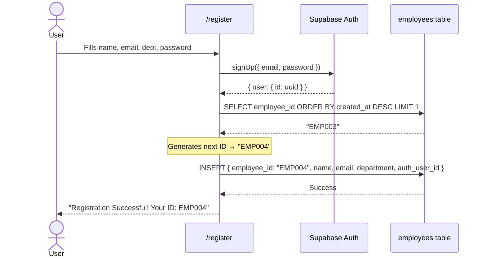
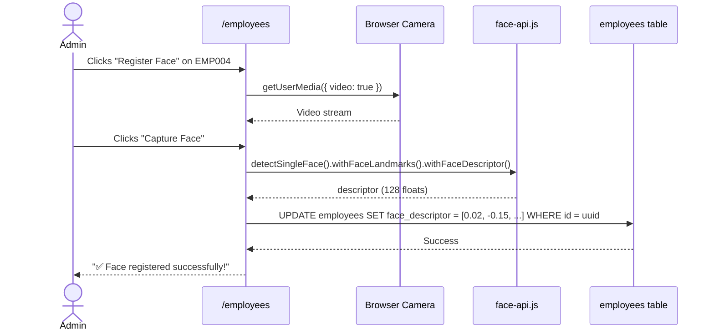
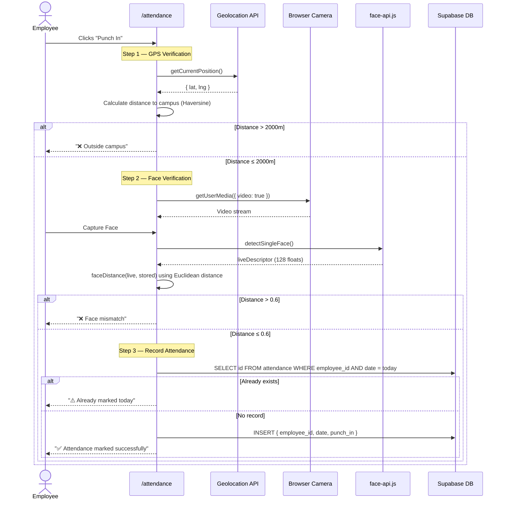
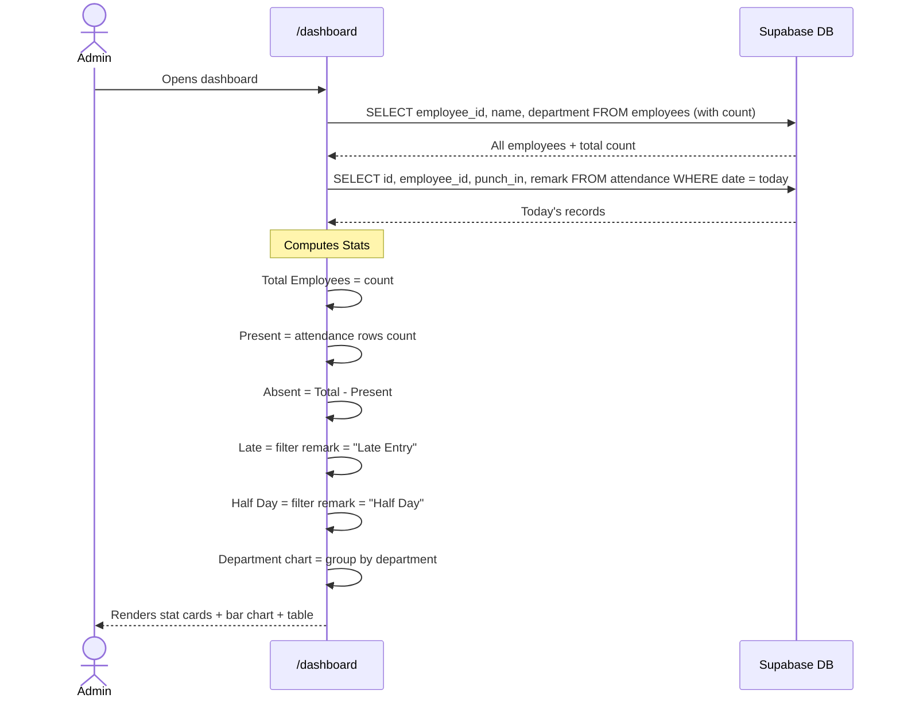

# 📘 Smart Attendance System — Database Schema Documentation

> **Project**: Smart Attendance System  
> **Tech Stack**: Next.js 16 + Supabase (PostgreSQL) + face-api.js  
> **Database**: Supabase-hosted PostgreSQL  
> **Last Updated**: March 2026

---

## 📑 Table of Contents

1. [System Overview](#1-system-overview)
2. [Entity-Relationship Diagram](#2-entity-relationship-diagram)
3. [Authentication Model (Supabase Auth)](#3-authentication-model-supabase-auth)
4. [Table: `employees`](#4-table-employees)
5. [Table: `attendance`](#5-table-attendance)
6. [Table: `profiles`](#6-table-profiles)
7. [Table: `user_roles`](#7-table-user_roles)
8. [How the Tables Work Together](#8-how-the-tables-work-together)
9. [Data Flow: Complete User Journeys](#9-data-flow-complete-user-journeys)
10. [CRUD Operation Mapping](#10-crud-operation-mapping)
11. [Security & Access Control](#11-security--access-control)
12. [Key Design Decisions](#12-key-design-decisions)

---

## 1. System Overview

The Smart Attendance System is a **face-recognition and GPS-based attendance management system** built for organizations. It has two user roles:

| Role | Capabilities |
|------|-------------|
| **Admin** | Manage employees, register faces, view attendance reports, track absentees |
| **Employee** | Self-register, punch in (with face + GPS verification), view own attendance history |

The database consists of **4 tables** in the `public` schema, plus the built-in **`auth.users`** table managed by Supabase:

```
auth.users          ← Supabase-managed authentication
public.employees    ← Employee profiles + face biometric data
public.attendance   ← Daily attendance records (punch in/out)
public.profiles     ← Role assignments (linked to auth.users)
public.user_roles   ← Role assignments (alternate/legacy table)
```

---

## 2. Entity-Relationship Diagram

```mermaid
erDiagram
    AUTH_USERS {
        uuid id PK
        text email
        text encrypted_password
        timestamp created_at
    }

    EMPLOYEES {
        uuid id PK
        text employee_id UK
        text name
        text email UK
        text department
        text role
        timestamp created_at
        array face_descriptor
        uuid auth_user_id FK
    }

    ATTENDANCE {
        bigint id PK
        text employee_id FK
        date date
        timestamptz punch_in
        timestamptz punch_out
        timestamptz created_at
        text status
        text remark
    }

    PROFILES {
        uuid id PK_FK
        text role
    }

    USER_ROLES {
        uuid id PK_FK
        text role
    }

    AUTH_USERS ||--o| EMPLOYEES : "auth_user_id"
    AUTH_USERS ||--o| PROFILES : "id"
    AUTH_USERS ||--o| USER_ROLES : "id"
    EMPLOYEES ||--o{ ATTENDANCE : "employee_id"
```

### Relationship Summary

| From | To | Type | Key |
|------|----|------|-----|
| `employees.auth_user_id` | `auth.users.id` | Many-to-One | Links employee to their login account |
| `profiles.id` | `auth.users.id` | One-to-One | Stores role for an auth user |
| `user_roles.id` | `auth.users.id` | One-to-One | Stores role for an auth user (alternate) |
| `attendance.employee_id` | `employees.employee_id` | Many-to-One | Links attendance record to employee (logical FK, not enforced in DB) |

---

## 3. Authentication Model (Supabase Auth)

The system uses **Supabase Auth** (`auth.users`) as the identity provider. This is a built-in table managed entirely by Supabase — you never write to it directly from SQL.

### How Auth Works in this App

```
User Signs Up (/register)
  └─→ supabase.auth.signUp({ email, password })
       └─→ Creates row in auth.users automatically
       └─→ App then creates row in public.employees with auth_user_id

User Logs In (/login)
  └─→ supabase.auth.signInWithPassword({ email, password })
       └─→ Returns JWT + user object
       └─→ App checks if email === "admin@company.com" → /dashboard
       └─→ Otherwise checks employees table → /attendance
```

> [!IMPORTANT]
> Admin detection is **email-based hardcoded check**: `admin@company.com`. There is no database role lookup during login. The `profiles` and `user_roles` tables exist for potential Row Level Security (RLS) policies or future role-based routing.

---

## 4. Table: `employees`

### Purpose
Stores all employee information including **biometric face data** used for face-recognition attendance verification.

### Schema

```sql
CREATE TABLE public.employees (
  id              uuid        NOT NULL DEFAULT gen_random_uuid(),
  employee_id     text        NOT NULL UNIQUE,
  name            text        NOT NULL,
  email           text        UNIQUE,
  department      text,
  role            text        DEFAULT 'employee'::text,
  created_at      timestamptz DEFAULT now(),
  face_descriptor ARRAY,
  auth_user_id    uuid,

  CONSTRAINT employees_pkey           PRIMARY KEY (id),
  CONSTRAINT employees_auth_user_id_fkey FOREIGN KEY (auth_user_id)
             REFERENCES auth.users(id)
);
```

### Column Details

| Column | Type | Nullable | Default | Description |
|--------|------|----------|---------|-------------|
| `id` | `uuid` | ❌ | `gen_random_uuid()` | Internal primary key (auto-generated UUID) |
| `employee_id` | `text` | ❌ | — | **Human-readable unique ID** like `EMP001`, `EMP002`. Used as the link to attendance records |
| `name` | `text` | ❌ | — | Full name of the employee |
| `email` | `text` | ✅ | — | Email used for login — matches `auth.users.email`. Has a UNIQUE constraint |
| `department` | `text` | ✅ | — | Department name (e.g., "Engineering", "HR") |
| `role` | `text` | ✅ | `'employee'` | Role string — either `'admin'` or `'employee'` |
| `created_at` | `timestamptz` | ✅ | `now()` | When the employee record was created |
| `face_descriptor` | `ARRAY` | ✅ | — | **128-dimensional face embedding** from `face-api.js`. Stored as a float array. `NULL` means face not yet registered |
| `auth_user_id` | `uuid` | ✅ | — | FK to `auth.users.id` — links this employee to their Supabase auth account |

### Constraints

| Constraint | Type | Description |
|-----------|------|-------------|
| `employees_pkey` | PRIMARY KEY | On `id` (UUID) |
| `employee_id` | UNIQUE | Ensures no duplicate employee IDs |
| `email` | UNIQUE | Ensures no duplicate emails |
| `employees_auth_user_id_fkey` | FOREIGN KEY | References `auth.users(id)` |

### How It's Used in the App

| Component | Operation | Details |
|-----------|-----------|---------|
| [register/page.tsx](file:///d:/4th%20year/smart-attendance-system/app/register/page.tsx) | **INSERT** | Creates employee after `auth.signUp()`. Auto-generates `employee_id` (e.g., `EMP001`) |
| [Attendance.tsx](file:///d:/4th%20year/smart-attendance-system/app/components/Attendance.tsx) | **SELECT** | Fetches `employee_id` + `face_descriptor` by email for face verification |
| [FaceRegister.tsx](file:///d:/4th%20year/smart-attendance-system/app/components/FaceRegister.tsx) | **UPDATE** | Saves the 128-float `face_descriptor` array after capturing face via camera |
| [EmployeesClient.tsx](file:///d:/4th%20year/smart-attendance-system/app/employees/EmployeesClient.tsx) | **SELECT / DELETE** | Lists employees with pagination; admin can delete employees |
| [InlineEditEmployeeModal.tsx](file:///d:/4th%20year/smart-attendance-system/app/components/InlineEditEmployeeModal.tsx) | **UPDATE** | Admin edits name, department |
| [AbsentDetection.tsx](file:///d:/4th%20year/smart-attendance-system/app/components/AbsentDetection.tsx) | **SELECT** | Fetches all `employee_id` + `name` to cross-reference against attendance |
| [dashboard/page.tsx](file:///d:/4th%20year/smart-attendance-system/app/dashboard/page.tsx) | **SELECT** | Fetches `employee_id, name, department` for stats + chart |

### The `face_descriptor` Column — Deep Dive

```
face_descriptor = [0.0234, -0.1523, 0.0891, ... ]   ← 128 floats
```

- **Generated by**: `face-api.js` library using the `TinyFaceDetector` + `FaceLandmark68Net` + `FaceRecognitionNet` models
- **Stored as**: PostgreSQL `ARRAY` (float array)
- **Used for**: Euclidean distance comparison during punch-in

```typescript
// Face matching logic (from Attendance.tsx)
function faceDistance(a: number[], b: number[]) {
  return Math.sqrt(a.reduce((sum, val, i) => sum + (val - b[i]) ** 2, 0));
}

// Threshold: 0.6 — below = match, above = mismatch
if (faceDistance(liveDescriptor, storedDescriptor) > 0.6) {
  // ❌ Face mismatch — attendance blocked
}
```

### Employee ID Generation

```typescript
// From register/page.tsx
async function generateEmployeeId() {
  const { data } = await supabase
    .from("employees")
    .select("employee_id")
    .order("created_at", { ascending: false })
    .limit(1)
    .single();

  if (!data?.employee_id) return "EMP001";

  const last = parseInt(data.employee_id.replace("EMP", ""), 10);
  return `EMP${String(last + 1).padStart(3, "0")}`;
}
// Result: EMP001, EMP002, EMP003, ...
```

---

## 5. Table: `attendance`

### Purpose
Records **daily attendance entries** for each employee, including punch-in/out timestamps, status, and remark (On Time / Late Entry / Half Day).

### Schema

```sql
CREATE TABLE public.attendance (
  id          bigint       GENERATED ALWAYS AS IDENTITY NOT NULL,
  employee_id text         NOT NULL,
  date        date         NOT NULL,
  punch_in    timestamptz,
  punch_out   timestamptz,
  created_at  timestamptz  DEFAULT now(),
  status      text,
  remark      text,

  CONSTRAINT attendance_pkey PRIMARY KEY (id)
);
```

### Column Details

| Column | Type | Nullable | Default | Description |
|--------|------|----------|---------|-------------|
| `id` | `bigint` | ❌ | Auto-increment (IDENTITY) | Auto-generated row ID |
| `employee_id` | `text` | ❌ | — | References `employees.employee_id` (logical FK). E.g., `"EMP001"` |
| `date` | `date` | ❌ | — | The calendar date of attendance (e.g., `2026-03-24`) |
| `punch_in` | `timestamptz` | ✅ | — | Exact timestamp when employee punched in |
| `punch_out` | `timestamptz` | ✅ | — | Exact timestamp when employee punched out (may be NULL if not yet punched out) |
| `created_at` | `timestamptz` | ✅ | `now()` | When the record was created |
| `status` | `text` | ✅ | — | General status field (e.g., `"Present"`, `"Absent"`) |
| `remark` | `text` | ✅ | — | Categorized remark — `"On Time"`, `"Late Entry"`, or `"Half Day"` |

### Constraints

| Constraint | Type | Description |
|-----------|------|-------------|
| `attendance_pkey` | PRIMARY KEY | On `id` (auto-increment bigint) |

> [!NOTE]
> There is **no formal FOREIGN KEY** from `attendance.employee_id` to `employees.employee_id`. The relationship is enforced at the **application level**. This is a design choice — it allows flexibility but bypasses referential integrity checks at the database level.

> [!WARNING]
> There is also **no UNIQUE constraint** on [(employee_id, date)](file:///d:/4th%20year/smart-attendance-system/app/dashboard/page.tsx#110-117) at the database level. The app prevents duplicate attendance via a runtime check in [Attendance.tsx](file:///d:/4th%20year/smart-attendance-system/app/components/Attendance.tsx):
> ```typescript
> const { data: existing } = await supabase
>   .from("attendance")
>   .select("id")
>   .eq("employee_id", employeeId)
>   .eq("date", today)
>   .single();
> if (existing) {
>   setStatus("⚠️ Attendance already marked today");
>   return;
> }
> ```

### How It's Used in the App

| Component | Operation | Details |
|-----------|-----------|---------|
| [Attendance.tsx](file:///d:/4th%20year/smart-attendance-system/app/components/Attendance.tsx) | **INSERT** | Creates attendance after face + GPS verification. Only `punch_in` is set initially |
| [AttendanceHistory.tsx](file:///d:/4th%20year/smart-attendance-system/app/components/AttendanceHistory.tsx) | **SELECT** | Fetches records for a selected date (admin view) |
| [AbsentDetection.tsx](file:///d:/4th%20year/smart-attendance-system/app/components/AbsentDetection.tsx) | **SELECT** | Fetches `employee_id` for a date, then cross-references with all employees to find absentees |
| [MonthlyAttendanceReport.tsx](file:///d:/4th%20year/smart-attendance-system/app/components/MonthlyAttendanceReport.tsx) | **SELECT** | Fetches all records in a month range, counts present days per employee |
| [dashboard/page.tsx](file:///d:/4th%20year/smart-attendance-system/app/dashboard/page.tsx) | **SELECT** | Fetches today's attendance for stat cards + table + department chart |
| [employee/page.tsx](file:///d:/4th%20year/smart-attendance-system/app/employee/page.tsx) | **SELECT** | Employee views their own attendance history (`id, date, status`) |

### Remark Values & Dashboard Badges

The `remark` field drives the **status badge** on the admin dashboard:

| Remark Value | Badge Color | Meaning |
|-------------|-------------|---------|
| `"On Time"` | 🟢 Green | Employee arrived on time |
| `"Late Entry"` | 🟡 Yellow | Employee arrived late |
| `"Half Day"` | 🟠 Orange | Employee worked half day |
| `NULL` | ⚪ Gray | No remark assigned |

---

## 6. Table: `profiles`

### Purpose
Maps a Supabase auth user to an **application role**. The primary key `id` IS the `auth.users.id` — making it a 1:1 extension of the auth table.

### Schema

```sql
CREATE TABLE public.profiles (
  id   uuid NOT NULL,
  role text NOT NULL CHECK (role = ANY (ARRAY['admin'::text, 'employee'::text])),

  CONSTRAINT profiles_pkey    PRIMARY KEY (id),
  CONSTRAINT profiles_id_fkey FOREIGN KEY (id) REFERENCES auth.users(id)
);
```

### Column Details

| Column | Type | Nullable | Default | Description |
|--------|------|----------|---------|-------------|
| `id` | `uuid` | ❌ | — | Same as `auth.users.id` — acts as both PK and FK |
| `role` | `text` | ❌ | — | Must be either `'admin'` or `'employee'` (enforced by CHECK constraint) |

### Constraints

| Constraint | Type | Description |
|-----------|------|-------------|
| `profiles_pkey` | PRIMARY KEY | On `id` |
| `profiles_id_fkey` | FOREIGN KEY | References `auth.users(id)` |
| CHECK | CHECK | `role` must be `'admin'` or `'employee'` |

> [!TIP]
> This table is designed for **Supabase Row Level Security (RLS)**. A common pattern is to use `profiles.role` in RLS policies to restrict what data each user can access. For example:
> ```sql
> CREATE POLICY "Admins can view all employees"
>   ON public.employees FOR SELECT
>   USING (
>     (SELECT role FROM public.profiles WHERE id = auth.uid()) = 'admin'
>   );
> ```

### Current App Usage

The `profiles` table is **not directly queried** by the frontend code. Role detection is currently done via:
```typescript
// lib/auth.ts
export function isAdmin(email: string | undefined | null) {
  return email === "admin@company.com";
}
```

This table exists as **infrastructure for RLS policies** that may be set up server-side in Supabase.

---

## 7. Table: `user_roles`

### Purpose
Functionally **identical** to `profiles` — it maps a Supabase auth user to a role. This appears to be a **duplicate/legacy table**, possibly created during development.

### Schema

```sql
CREATE TABLE public.user_roles (
  id   uuid NOT NULL,
  role text NOT NULL CHECK (role = ANY (ARRAY['admin'::text, 'employee'::text])),

  CONSTRAINT user_roles_pkey    PRIMARY KEY (id),
  CONSTRAINT user_roles_id_fkey FOREIGN KEY (id) REFERENCES auth.users(id)
);
```

### Column Details

| Column | Type | Nullable | Default | Description |
|--------|------|----------|---------|-------------|
| `id` | `uuid` | ❌ | — | Same as `auth.users.id` |
| `role` | `text` | ❌ | — | Must be `'admin'` or `'employee'` |

> [!NOTE]
> `user_roles` is structurally identical to `profiles`. Both serve the same purpose. Like `profiles`, it is **not directly queried** by the frontend. It likely exists as an alternative naming convention or was created for a different set of RLS policies.

---

## 8. How the Tables Work Together

### Complete Data Model Flow

```
┌─────────────────────────────────────────────────────────────┐
│                     SUPABASE AUTH                            │
│  ┌──────────────┐                                           │
│  │  auth.users   │ ← Handles login/signup/JWT               │
│  │  id (uuid)    │                                           │
│  │  email        │                                           │
│  │  password     │                                           │
│  └──────┬───┬───┘                                           │
│         │   │                                                │
└─────────┼───┼────────────────────────────────────────────────┘
          │   │
    ┌─────┘   └──────────────────────────┐
    ▼                                    ▼
┌──────────────┐                  ┌──────────────┐ ┌───────────────┐
│  profiles     │                  │  user_roles   │ │  employees     │
│  id = user.id │                  │  id = user.id │ │  auth_user_id  │◄─┐
│  role         │                  │  role         │ │  employee_id   │  │
└──────────────┘                  └───────────────┘ │  name          │  │
                                                     │  face_descriptor│  │
   Used for RLS policies                             │  email         │  │
   (server-side only)                                │  department    │  │
                                                     └───────┬───────┘  │
                                                              │          │
                                                    employee_id (text)   │
                                                              │          │
                                                              ▼          │
                                                     ┌────────────────┐  │
                                                     │  attendance     │  │
                                                     │  employee_id   │──┘
                                                     │  date          │  (logical, not enforced)
                                                     │  punch_in      │
                                                     │  punch_out     │
                                                     │  status        │
                                                     │  remark        │
                                                     └────────────────┘
```

### Key Relationships Explained

1. **`auth.users` → `employees`** (via `auth_user_id`)
   - Created during registration
   - Used to look up the employee record when a user logs in
   - The app also uses `email` matching (not just FK) to find employees

2. **`employees` → `attendance`** (via `employee_id` text)
   - One employee can have **many** attendance records (one per day max)
   - The link is the human-readable `employee_id` (e.g., `"EMP003"`), not the UUID

3. **`auth.users` → `profiles` / `user_roles`** (via `id`)
   - 1:1 mapping for role storage
   - Used by database-level security (RLS), not by frontend code directly

---

## 9. Data Flow: Complete User Journeys

### 9.1 Employee Self-Registration



### 9.2 Admin Registers Employee's Face



### 9.3 Employee Punches In (Full Verification)



### 9.4 Admin Views Dashboard



---

## 10. CRUD Operation Mapping

### `employees` Table

| Operation | Where | SQL Equivalent |
|-----------|-------|---------------|
| **CREATE** | `/register` (self-signup) | `INSERT INTO employees (employee_id, name, email, department, role, auth_user_id)` |
| **CREATE** | [EmployeeForm.tsx](file:///d:/4th%20year/smart-attendance-system/app/components/EmployeeForm.tsx) (admin adds) | `INSERT INTO employees (employee_id, name, department)` |
| **READ** | `/login` | `SELECT employee_id FROM employees WHERE email = ?` |
| **READ** | [Attendance.tsx](file:///d:/4th%20year/smart-attendance-system/app/components/Attendance.tsx) | `SELECT employee_id, face_descriptor FROM employees WHERE email = ?` |
| **READ** | [EmployeesClient.tsx](file:///d:/4th%20year/smart-attendance-system/app/employees/EmployeesClient.tsx) | `SELECT * FROM employees ORDER BY id DESC LIMIT 6 OFFSET ?` |
| **READ** | [AbsentDetection.tsx](file:///d:/4th%20year/smart-attendance-system/app/components/AbsentDetection.tsx) | `SELECT employee_id, name FROM employees` |
| **READ** | [dashboard/page.tsx](file:///d:/4th%20year/smart-attendance-system/app/dashboard/page.tsx) | `SELECT employee_id, name, department FROM employees` |
| **UPDATE** | [FaceRegister.tsx](file:///d:/4th%20year/smart-attendance-system/app/components/FaceRegister.tsx) | `UPDATE employees SET face_descriptor = ? WHERE id = ?` |
| **UPDATE** | [FaceCapture.tsx](file:///d:/4th%20year/smart-attendance-system/app/components/FaceCapture.tsx) (via EmployeeForm) | `UPDATE employees SET face_descriptor = ? WHERE id = ?` |
| **UPDATE** | [InlineEditEmployeeModal.tsx](file:///d:/4th%20year/smart-attendance-system/app/components/InlineEditEmployeeModal.tsx) | `UPDATE employees SET name = ?, department = ? WHERE id = ?` |
| **UPDATE** | [EmployeeList.tsx](file:///d:/4th%20year/smart-attendance-system/app/components/EmployeeList.tsx) | `UPDATE employees SET name = ?, department = ? WHERE id = ?` |
| **DELETE** | [EmployeesClient.tsx](file:///d:/4th%20year/smart-attendance-system/app/employees/EmployeesClient.tsx) | `DELETE FROM employees WHERE id = ?` |
| **DELETE** | [EmployeeList.tsx](file:///d:/4th%20year/smart-attendance-system/app/components/EmployeeList.tsx) | `DELETE FROM employees WHERE id = ?` |

### `attendance` Table

| Operation | Where | SQL Equivalent |
|-----------|-------|---------------|
| **CREATE** | [Attendance.tsx](file:///d:/4th%20year/smart-attendance-system/app/components/Attendance.tsx) | `INSERT INTO attendance (employee_id, date, punch_in)` |
| **READ** | [Attendance.tsx](file:///d:/4th%20year/smart-attendance-system/app/components/Attendance.tsx) (duplicate check) | `SELECT id FROM attendance WHERE employee_id = ? AND date = ?` |
| **READ** | [AttendanceHistory.tsx](file:///d:/4th%20year/smart-attendance-system/app/components/AttendanceHistory.tsx) | `SELECT employee_id, punch_in, punch_out FROM attendance WHERE date = ?` |
| **READ** | [AbsentDetection.tsx](file:///d:/4th%20year/smart-attendance-system/app/components/AbsentDetection.tsx) | `SELECT employee_id FROM attendance WHERE date = ?` |
| **READ** | [MonthlyAttendanceReport.tsx](file:///d:/4th%20year/smart-attendance-system/app/components/MonthlyAttendanceReport.tsx) | `SELECT employee_id, date FROM attendance WHERE date BETWEEN ? AND ?` |
| **READ** | [dashboard/page.tsx](file:///d:/4th%20year/smart-attendance-system/app/dashboard/page.tsx) | `SELECT id, employee_id, punch_in, remark FROM attendance WHERE date = today` |
| **READ** | [employee/page.tsx](file:///d:/4th%20year/smart-attendance-system/app/employee/page.tsx) | `SELECT id, date, status FROM attendance WHERE employee_id = ?` |

### `profiles` & `user_roles` Tables

| Operation | Where | SQL Equivalent |
|-----------|-------|---------------|
| No frontend operations | Used at RLS/database level only | — |

---

## 11. Security & Access Control

### Current Security Model

```
┌────────────────────────────────────────────────────────┐
│                    SECURITY LAYERS                      │
├────────────────────────────────────────────────────────┤
│                                                        │
│  Layer 1: Supabase Auth (JWT)                          │
│  ├── Login required to access any data                 │
│  └── supabase.auth.getUser() verifies session          │
│                                                        │
│  Layer 2: Client-Side Role Check                       │
│  ├── isAdmin() checks email === "admin@company.com"    │
│  ├── Admin → /dashboard                                │
│  └── Employee → /attendance                            │
│                                                        │
│  Layer 3: Database (RLS - if configured)               │
│  ├── profiles table → role-based policies              │
│  └── user_roles table → role-based policies            │
│                                                        │
│  Layer 4: Biometric + GPS (Attendance Only)            │
│  ├── GPS: Must be within 2km of campus                 │
│  ├── Face: Euclidean distance ≤ 0.6 threshold          │
│  └── Duplicate: Only one punch-in per day              │
│                                                        │
└────────────────────────────────────────────────────────┘
```

### GPS Verification Config

```typescript
const CAMPUS_LAT    = 11.513944566899058;
const CAMPUS_LNG    = 77.24670983047233;
const ALLOWED_RADIUS = 2000; // meters
```

The Haversine formula calculates the distance between the user's current location and the campus center. If the distance exceeds 2000m, attendance is blocked.

---

## 12. Key Design Decisions

### ✅ Good Patterns

| Decision | Rationale |
|----------|-----------|
| **UUID for `employees.id`** | Prevents sequential enumeration, safe for exposed APIs |
| **Auto-increment for `attendance.id`** | Simple, efficient for high-write table |
| **`employee_id` as text (EMP001)** | Human-readable, good for reports and display |
| **`face_descriptor` stored in DB** | Avoids external file storage; fast lookup for single-employee verification |
| **Separate `auth.users` from `employees`** | Clean separation of authentication and business data |
| **`timestamptz` for punch times** | Timezone-aware timestamps ensure correctness across timezones |

### ⚠️ Potential Improvements

| Observation | Suggestion |
|-------------|-----------|
| **No DB-level FK** from `attendance.employee_id` → `employees.employee_id` | Add `FOREIGN KEY (employee_id) REFERENCES employees(employee_id)` for referential integrity |
| **No UNIQUE constraint** on [(employee_id, date)](file:///d:/4th%20year/smart-attendance-system/app/dashboard/page.tsx#110-117) in `attendance` | Add `UNIQUE(employee_id, date)` to prevent duplicate records at the DB level |
| **Duplicate tables** `profiles` and `user_roles` | Consolidate into one table |
| **Hardcoded admin check** (`admin@company.com`) | Use `profiles.role` or `user_roles.role` for proper RBAC |
| **`face_descriptor` as generic ARRAY** | Consider `float8[]` for explicit typing |
| **`status` and `remark` are free-text** | Use `CHECK` constraints or an ENUM type for data consistency |
| **No `punch_out` logic** | The app currently only handles `punch_in` — `punch_out` column exists but is never written to |

---

> [!TIP]
> **Quick Reference — What Each Table Stores:**
> - **`employees`** = Who they are + their face biometric data
> - **`attendance`** = When they showed up (per day)
> - **`profiles`** = What role they have (for DB security)
> - **`user_roles`** = Same as profiles (duplicate)
> - **`auth.users`** = Their login credentials (managed by Supabase)
